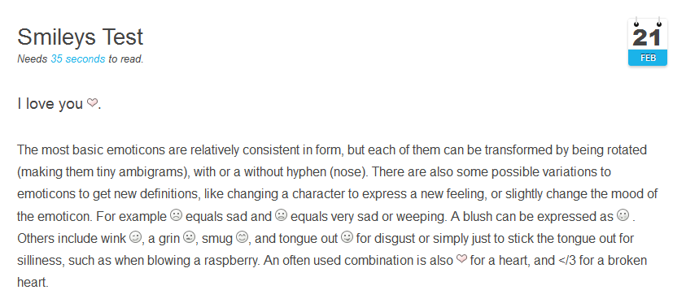

# [Grav Smileys Plugin][project]

> This plugin substitutes text emoticons, also known as smilies like :-), with images.

## About

Smileys, also known as "emoticons," is a pictorial representation of a facial expression to convey emotions in your writing. They are a great way to brighten up texts.

Text smileys are created by typing two or more punctuation marks. Some examples are:

> :-) :D :'-( <3

By default, [Grav Smileys Plugin][project] automatically converts text smileys to graphic images. When you type ;-) in your page you see smile emoticon when you preview or publish your page.

Further it comes with a pre-configured set of example smileys (using [Grav Smileys Data Pack -- Simple Smileys](https://github.com/sommerregen/grav-data-smileys-simple-smileys)). An unlimited amount of custom smileys can be setup as well.

If you want, you can add your own smileys by importing ready to use packages available around the internet (the list will be updated continuously):

>  * **Simple Smileys** -- https://github.com/sommerregen/grav-data-smileys-simple-smileys
>  * **Pidgin Smileys** -- https://github.com/sommerregen/grav-data-smileys-pidgin-smileys
>  * **Tango** -- https://github.com/sommerregen/grav-data-smileys-tango
>  * **Emoji** -- https://github.com/sommerregen/grav-data-smileys-emoji

If you are interested in seeing this plugin in action, here is a screenshot:



## Installation and Updates

Installing or updating the `Smileys` plugin can be done in one of two ways. Using the GPM (Grav Package Manager) installation method or manual install or update method by downloading [this plugin](https://github.com/sommerregen/grav-plugin-smileys) and extracting all plugin files to

    /your/site/grav/user/plugins/smileys

For more informations, please check the [Installation and update guide](docs/INSTALL.md).

## Usage

The `Smileys` plugin comes with some sensible default configuration, that are pretty self explanatory:

### Config Defaults

```
# Global plugin configurations

enabled: true                 # Set to false to disable this plugin completely
built_in_css: true            # Use built-in CSS of the plugin
weight: 1                			# Set the weight (order of execution)

# Default values for Smileys configuration.

pack: simple_smileys          # The name of the smileys package

# Global and page specific configurations

process: true                 # Filter smileys
exclude:
  tags: [code, pre]           # Exclude tags from smiley replacement
  classes: [mathjax, latex]   # Exclude classes from smiley replacement
```

If you need to change any value, then the best process is to copy the [smileys.yaml](smileys.yaml) file into your `users/config/plugins/` folder (create it if it doesn't exist), and then modify there. This will override the default settings.

If you want to alter the settings for one or a few pages only, you can do so by adding page specific configurations into your page headers, e.g.

```
smileys:
  process: false
```

to switch off `Smileys` plugin just for this page.

### CSS Stylesheet Override

Something you might want to do is to override the look and feel of the external links, and with Grav it is super easy.

Copy the stylesheet [css/smileys.css](css/smileys.css) into the `css` folder of your custom theme, and add it to the list of CSS files.

```
/your/site/grav/user/themes/custom-theme/css/smileys.css
```

After that set the `built_in_css` option of the `Smileys` plugin to `false`. That's it.

You can now edit, override and tweak it however you prefer. The smiley images in are automatically given a CSS class of `smileys` when they are displayed in on a page. You can use this class to style your smileys differently from other images.

## Contributing

You can contribute at any time! Before opening any issue, please search for existing issues and review the [guidelines for contributing](docs/CONTRIBUTING.md).

After that please note:

* If you find a bug or would like to make a feature request or suggest an improvement, [please open a new issue][issues]. If you have any interesting ideas for additions to the syntax please do suggest them as well!
* Feature requests are more likely to get attention if you include a clearly described use case.
* If you wish to submit a pull request, please make again sure that your request match the [guidelines for contributing](docs/CONTRIBUTING.md) and that you keep track of adding unit tests for any new or changed functionality.

### Support and donations

If you like my project, feel free to support me via [][flattr] or by sending me some bitcoins to **1HQdy5aBzNKNvqspiLvcmzigCq7doGfLM4**.

Thanks!

## License

Copyright (c) 2015 [Benjamin Regler][github]. See also the list of [contributors] who participated in this project.

[Licensed](LICENSE) for use under the terms of the [MIT license][mit-license].

[github]: https://github.com/sommerregen/ "GitHub account from Benjamin Regler"
[mit-license]: http://www.opensource.org/licenses/mit-license.php "MIT license"

[flattr]: https://flattr.com/submit/auto?user_id=Sommerregen&url=https://github.com/sommerregen/grav-plugin-smileys "Flatter my GitHub project"

[project]: https://github.com/sommerregen/grav-plugin-smileys
[issues]: https://github.com/sommerregen/grav-plugin-smileys/issues "GitHub Issues for Grav Smileys Plugin"
[contributors]: https://github.com/sommerregen/grav-plugin-smileys/graphs/contributors "List of contributors of the project"
